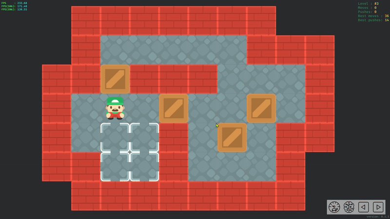

# sokoban-rs

A sokoban with a solver.

## Features

- Full mouse control.
- Integrated solver.
- Front-end and back-end separation.
- Levels and solutions are stored in the database.

## Keymap

### Mouse

| Key                                   | Action                                   |
|---------------------------------------|------------------------------------------|
| Click `Left` on player reachable area | Move the character to this position      |
| Click `Left` on a crate               | Show the reachable area of the crate     |
| Click `Left` on crate reachable area  | Push the selected crate to this position |
| Hold `Right` and drag                 | Drag the board                           |
| Click `Button 4`                      | Undo last push                           |
| Click `Button 5`                      | Redo last push                           |
| Scroll `Middle`                       | Zoom in/out                              |

### Keyboard

| Key                    | Action                            |
|------------------------|-----------------------------------|
| `W`/`A`/`S`/`D`        | Move the character                |
| Arrow keys             | Move the character                |
| `[`/`]`                | Switch to the previous/next level |
| `Ctrl` + `Z`           | Undo last push                    |
| `Ctrl` + `Shift` + `Z` | Redo last push                    |
| `-`/`=`                | Zoom in/out                       |
| `Ctrl` + `V`           | Import levels from clipboard      |
| `Ctrl` + `C`           | Export level to clipboard         |
| `P`                    | Automatic solution                |
| `I`                    | Trigger instant move[^1]          |

### Keyboard (Vim)

| Key             | Action                            |
|-----------------|-----------------------------------|
| `H`/`J`/`K`/`L` | Move the character                |
| `[`/`]`         | Switch to the previous/next level |
| `U`             | Undo last push                    |
| `Ctrl` + `R`    | Redo last push                    |

### Controller

| Key               | Action                            |
|-------------------|-----------------------------------|
| D-Pad             | Move the character                |
| `LB`/`RB`         | Switch to the previous/next level |
| `B`/`Circle`      | Undo last push                    |
| `A`/`Cross`       | Redo last push                    |
| `LT`/`RT`         | Zoom in/out                       |
| Left stick        | Move viewport                     |
| `Y`/`Triangle`    | Automatic solution                |

[^1]: Turn off character and crates movement animations.
