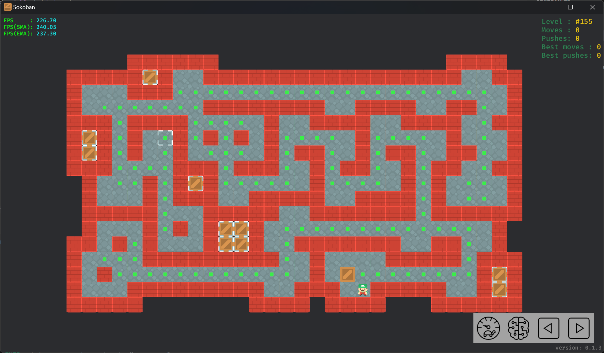
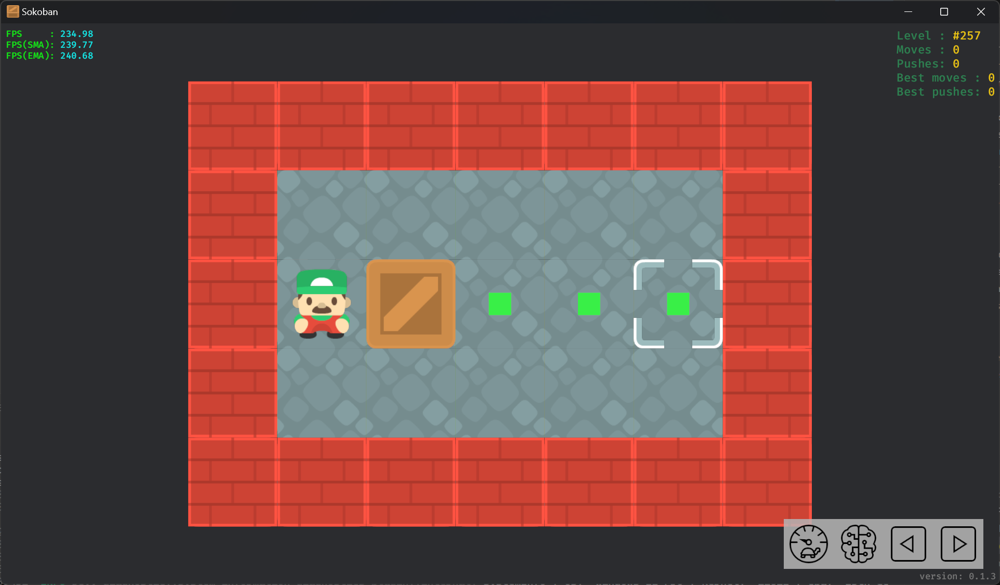

# Auto crate push

This feature can provide good assistance when users play larger levels.  
At the same time, it also retains the traditional control method.

Clicking on a crate will display all the points that the crate can reach (without moving other crates).

Take Microban #155 as an example:

Clicking on one of the points will automatically push the selected crate to that position.

In this case, user can click on the target, and the character will automatically push the selected crate to the target to complete the level.

Some areas where the crates are reachable do not display points. This is because pushing the crate to those positions will lead to a deadlock and the player will be unable to continue completing the level.

## Controversial

This feature is a bit controversial, with some people saying it's akin to cheating.

For simple levels, this does significantly reduce the level difficulty. An extreme example is a level with only a single crate and target, which means the player can complete it without having to do any reasoning.

But for complex levels, the difficulty mainly lies in the complex pushing relationship between multiple crates, rather than the pushing of a single crate. This feature allows players to focus on more complex reasoning instead of repeating the simple work of pushing a single crate.

In addition, this feature is **optional**. Users can still use the traditional control methods.
