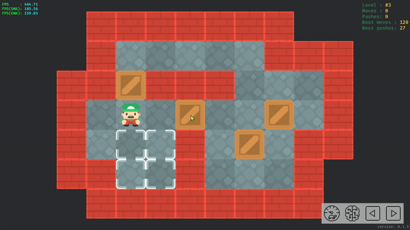
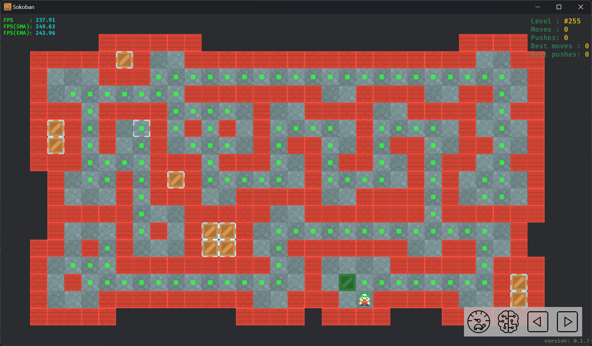
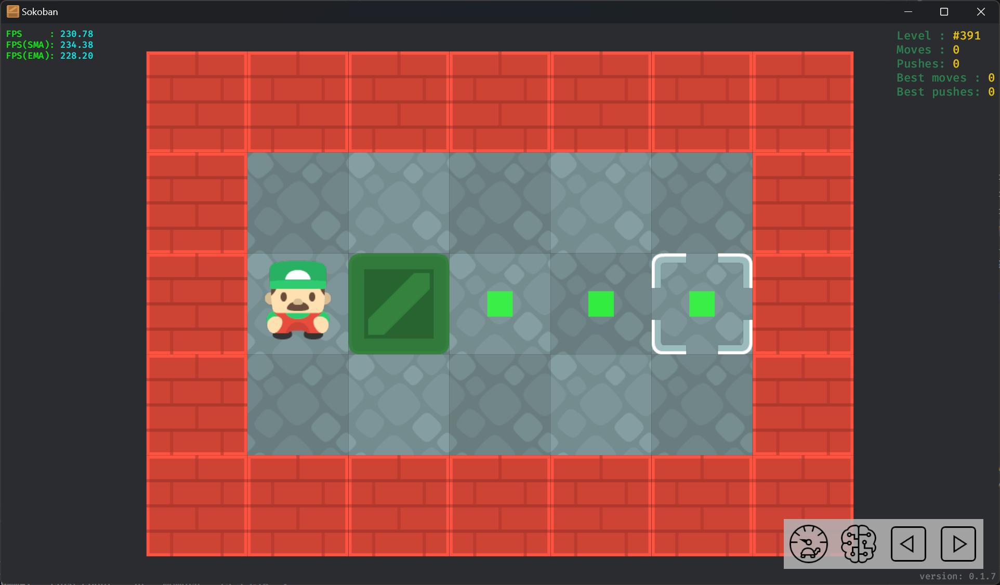
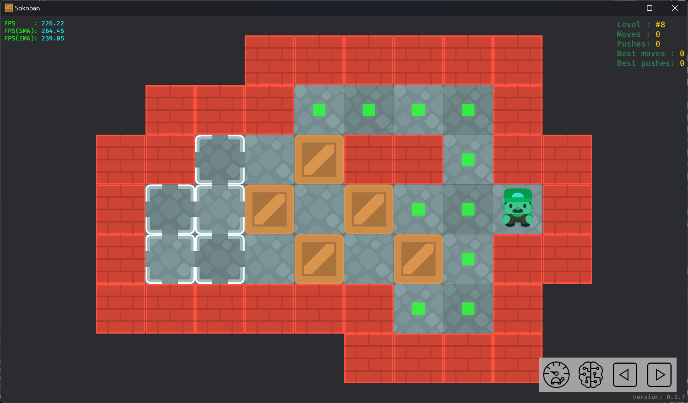

# Auto move

## Auto box push

This feature can significantly assist users when playing larger levels while maintaining the traditional control method.

Clicking on a box will display all the points that the box can reach (without moving other boxes).

Take Microban #155 as an example:

Clicking on one of these points will automatically push the selected box to that position.

In this case, the user can click on the target, and the character will automatically push the selected box to that target to complete the level.

Some areas where the boxes are reachable do not display points. This is because pushing the box to those positions would lead to a deadlock, making it impossible for the player to continue and complete the level.

## Auto player move

Click to select the player and display the player's reachable area. Clicking on a position within this area will make the player automatically move to that position.

Users can also directly click on the player's reachable area without selecting the player, and the player will automatically move to that position.

## Controversial

This feature is somewhat controversial, with some users arguing that it is akin to cheating.

For simple levels, it does significantly reduce the difficulty. For example, a level with only a single box and target can be completed without any additional reasoning.

However, for challenging levels, the difficulty mainly lies in the intricate relationships between multiple boxes, rather than the task of pushing a single box. This feature allows players to focus on more complex reasoning instead of repeatedly performing the simple task of pushing a single box.

Additionally, this feature is **optional**. Users can still use the traditional control methods.
