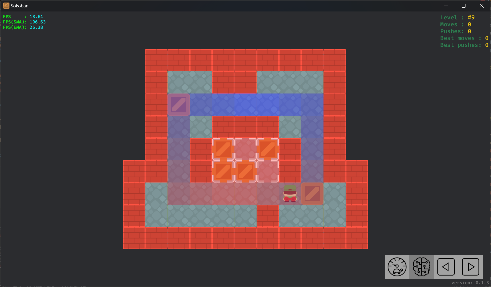

# Solver

The solver can automatically solve levels of moderate complexity.

## Strategy

- `Fast`: Speed priority.
- `Mixed`: Balanced speed and steps.
- `OptimalMovePush`: Find move optimal solutions with best pushes.
- `OptimalPushMove`: Find push optimal solutions with best moves.

## Lower bound calculation method

- `MinimumPush`: Minimum push count to nearest target.
- `MinimumMove`: Minimum move count to nearest target. (This method is slow, especially on maps with many boxes or large areas)
- `ManhattanDistance`: Manhattan distance to nearest target. (This method is fast, suitable for maps with many boxes or large areas)

## Optimization

- Deadlocks detection.
  - Detects dead square deadlocks.
  - Detects freeze deadlocks.
- Tunnels detection.

## Statistics

CPU       : 13th Gen Intel(R) Core(TM) i9-13900HX (Base speed: 2.20 GHz).  
Threads   : 1.  
Time limit: 10 seconds.

| Collection          | Total | Solved |
| ------------------- | ----- | ------ |
| box_world_100.xsb   | 100   | 41     |
| microban_155.xsb    | 155   | 144    |
| microban_II_135.xsb | 135   | 109    |

## Visualization

Supports visualizing the automatic solution process. This feature can be used to intuitively view the working status of the solver.

- Displays the optimal state obtained by the current solver.
- Display the lower bound as a heat map.

